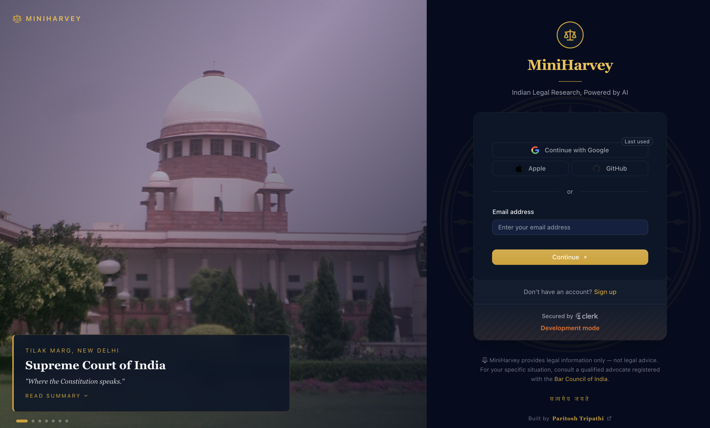
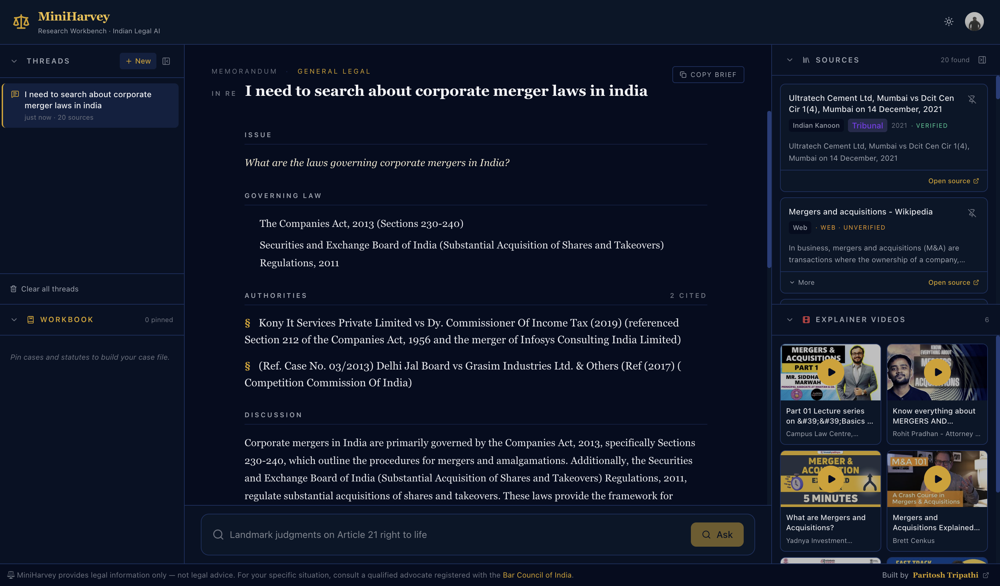

# MiniHarvey

[](https://app.netlify.com/sites/mini-harvey/deploys)
[](https://uptime.betterstack.com/?utm_source=status_badge)
[](https://miniharvery.onrender.com/api/v1/health)

<!--
  Netlify badge: replace <NETLIFY_SITE_API_ID> with your Site API ID.
  Find it in Netlify dashboard → Site settings → General → Site details → API ID,
  or: Site settings → General → Status badges (it builds the full markdown for you).
-->

**An AI research workbench for Indian law.**
Ask a question, get a structured legal brief — Issue, Governing Law, Authorities, Discussion, Conclusion, Recommended Actions — backed by citations from Indian Kanoon, India Code, and curated web sources.

> ⚠️ Under active development. MiniHarvey provides **legal information only**, not legal advice. For your matter, consult an advocate registered with the Bar Council of India.

---

## What it does

MiniHarvey turns a plain-English legal question ("What are my rights if arrested without a warrant?") into a memo-style answer with:

- **Query rewriting** — your natural-language question is rewritten into a keyword-dense search query before hitting the providers.
- **Parallel search** across **Indian Kanoon** (case law), **India Code** (statutes/acts), and **Google CSE** (curated Indian legal web).
- **Source balancing** — results are round-robin interleaved by provider, not dominated by whoever returns fastest.
- **Streaming LLM answer** — a structured memo in the voice of "Harvey", with every section clearly labelled. Responses stream token-by-token.
- **Citation chips** — AIR, SCC, Section, and Article citations extracted from the answer; click one to flash the matching source card.
- **Follow-up questions** — three clickable chips at the bottom of each brief let you keep researching with one click.
- **Pinnable Workbook** — pin any case or statute to keep it across threads.
- **Explainer videos** — relevant YouTube explainers surfaced alongside sources.
- **Light & dark themes** — navy/gold chambers mode, or warm cream paper mode.

Inspired by [MiniPerplexity](https://github.com/paritoshtripathi935/MiniPerplexity) — same shape, but repurposed as a domain-specific legal assistant.

---

## Screenshots

### Sign-in — cinematic landmark-case slideshow



A split-screen login: on the left, a rotating slideshow of landmark Indian cases (Kesavananda Bharati, Maneka Gandhi, Vishaka, Puttaswamy, Navtej Singh Johar) layered over Wikimedia imagery of the Supreme Court; on the right, a Clerk sign-in card styled in chambers navy + gold, with a "Continue as guest" escape hatch and the सत्यमेव जयते motto.

### Workbench — three-pane research layout



The three-pane research surface in action. A corporate-merger query streams back a structured brief — **Issue → Governing Law → Authorities → Discussion** — with the Threads rail on the left, Sources + Explainer Videos on the right, and the composer docked beneath the brief for follow-ups.

- **Left sidebar** — Threads (history) + Workbook (pinned sources). Each section individually collapsible; the whole rail collapses to a thin icon strip.
- **Center** — the Brief: a typography-first legal memo with a gold Conclusion callout, clickable citation chips, and a follow-up chip strip.
- **Right sidebar** — Sources (color-tagged by provider — Kanoon / India Code / Google / Wikipedia) + YouTube Explainer Videos. Also individually collapsible.

---

## Architecture

```
┌─────────────┐       ┌──────────────────┐        ┌────────────────────┐
│  React UI   │──────►│  FastAPI Backend │───────►│  Cloudflare LLM    │
│  (Vite)     │  SSE  │  (Render)        │        │  Llama 3.1 70B     │
└─────────────┘       └────────┬─────────┘        └────────────────────┘
                               │
                               │ parallel, ThreadPoolExecutor
                               ▼
                    ┌─────────┬──────────┬─────────┐
                    │  Indian │  India   │  Google │
                    │  Kanoon │  Code    │  CSE    │
                    └─────────┴──────────┴─────────┘
```

### Request pipeline

```
User query
  ↓
Query classifier      (case_law / statute / general — keyword heuristic)
  ↓
Query rewriter        (Cloudflare LLM, 8s timeout, falls back silently to raw)
  ↓
Parallel search       (Indian Kanoon + India Code + Google CSE, 3 workers)
  ↓
Round-robin merge     (one result per provider per rank slot)
  ↓
Answer generation     (Cloudflare LLM, SSE streaming, max_tokens: 2048)
  ↓
Citation extraction   (AIR / SCC / Section / Article regex)
  ↓
SSE final frame:      { citations, suggested_steps, follow_ups }
```

### Why not SCI?
The Supreme Court of India's own portal (`main.sci.gov.in`) was pulled from the provider list — the judgment pages are JavaScript-rendered behind session cookies, the SSL certificate has a habit of expiring, and Indian Kanoon already indexes the full SC corpus with better metadata. If you need SC coverage, Indian Kanoon is the source of truth.

---

## Tech stack

| Layer           | Choice                                                        |
| --------------- | ------------------------------------------------------------- |
| Frontend        | React 18, TypeScript, Vite 8, Tailwind CSS 4                  |
| Auth            | Clerk v5                                                      |
| Markdown        | `react-markdown`                                              |
| Backend         | FastAPI, Pydantic, Uvicorn, Gunicorn                          |
| HTML extraction | BeautifulSoup 4                                               |
| Parallelism     | `concurrent.futures.ThreadPoolExecutor` (3 workers)           |
| LLM             | Cloudflare AI Workers — `@cf/meta/llama-3.1-70b-instruct`     |
| Search          | Indian Kanoon API · India Code scrape · Google CSE · YouTube Data API |
| Deploy          | Netlify (frontend) · Render (backend)                         |

---

## Project layout

```
MiniHarvey/
├── backend/
│   ├── main.py                         # FastAPI entry, CORS, router mount
│   ├── requirements.txt
│   ├── render.yaml
│   ├── .env.example
│   └── app/
│       ├── api/v1/query_handler.py     # /search, /answer (SSE), /session
│       ├── core/settings.py            # pydantic-settings
│       ├── services/
│       │   ├── legal_search_service.py # Parallel Kanoon + IndiaCode + Google
│       │   ├── content_extractor.py    # BS4 stripping
│       │   ├── query_classifier.py     # case_law / statute / general
│       │   └── language_model.py       # Cloudflare LLM, SSE, query rewrite
│       ├── models/                     # Pydantic request/response models
│       └── utils/                      # rate_limiter, session_store, citations
│
└── frontend/
    ├── package.json
    ├── vite.config.ts
    ├── netlify.toml
    ├── index.html
    ├── public/favicon.svg              # gold scales-of-justice
    └── src/
        ├── App.tsx                     # Root layout, three-pane orchestration
        ├── index.css                   # Theme tokens (light + dark)
        ├── types.ts
        ├── hooks/useTheme.ts           # localStorage + prefers-color-scheme
        ├── services/api.ts             # Streaming fetch client
        └── components/
            ├── LeftSidebar.tsx         # Threads + Workbook
            ├── Brief.tsx               # Legal memo renderer
            ├── SourcesPanel.tsx        # Sources + Videos
            ├── CaseCard.tsx            # Unified source card
            ├── VideoCard.tsx
            ├── SearchBar.tsx
            ├── CitationChip.tsx
            ├── JurisdictionBadge.tsx
            ├── DevBanner.tsx           # "LIVE · DEV" marquee
            ├── ThemeToggle.tsx
            ├── DisclaimerFooter.tsx
            ├── LoginPage.tsx           # Clerk-backed splash
            └── CollapsedRail.tsx       # 48px icon rail
```

---

## Running locally

### Prerequisites
- Python 3.10+
- Node 20+ and npm
- A Cloudflare AI Workers account (API token + account ID)
- An Indian Kanoon API token
- A Google API key with Custom Search + YouTube Data v3 enabled, and a CSE `cx`
- A Clerk project (publishable key + secret key)

### 1. Backend

```bash
cd backend
python -m venv .venv && source .venv/bin/activate
pip install -r requirements.txt
cp .env.example .env    # then fill in your tokens
uvicorn main:app --reload --port 8000
```

Health check: `curl http://localhost:8000/api/v1/health` → `{"status":"ok"}`

### 2. Frontend

```bash
cd frontend
npm install
cp .env.example .env    # set VITE_API_URL and VITE_CLERK_PUBLISHABLE_KEY
npm run dev
```

Open [http://localhost:5173](http://localhost:5173), sign in, and ask a question.

---

## Environment variables

### Backend (`backend/.env`)

| Variable                    | Required | Purpose                                                    |
| --------------------------- | :------: | ---------------------------------------------------------- |
| `CLOUDFLARE_API_TOKEN`      |    ✅    | Cloudflare AI Workers auth (also accepts `CLOUDFLARE_API_KEY`) |
| `CLOUDFLARE_ACCOUNT_ID`     |    ✅    | Cloudflare account ID for the Workers endpoint             |
| `INDIAN_KANOON_API_TOKEN`   |    ✅    | Indian Kanoon REST API token                               |
| `GOOGLE_API_KEY`            |    ✅    | Google Custom Search + YouTube Data v3                     |
| `GOOGLE_SEARCH_CX`          |    ✅    | Custom Search Engine ID                                    |
| `YOUTUBE_API_KEY`           |          | Optional — falls back to `GOOGLE_API_KEY`                  |
| `CLERK_SECRET_KEY`          |    ✅    | Server-side Clerk verification                             |
| `ALLOWED_ORIGINS`           |          | Comma-separated CORS origins (default: `http://localhost:5173`) |
| `ENV`                       |          | `dev` or `prod`                                            |
| `SESSION_TTL_SECONDS`       |          | In-memory session TTL (default `600`)                      |
| `RATE_LIMIT_CALLS_PER_MIN`  |          | Per-session rate limit (default `30`)                      |
| `MAX_SEARCH_RESULTS`        |          | Per-provider cap (default `10`)                            |

### Frontend (`frontend/.env`)

| Variable                      | Required | Purpose                      |
| ----------------------------- | :------: | ---------------------------- |
| `VITE_API_URL`                |    ✅    | Backend base URL             |
| `VITE_CLERK_PUBLISHABLE_KEY`  |    ✅    | Clerk client publishable key |

---

## API

```
POST  /api/v1/search/{session_id}   → rewritten-query + results + videos
POST  /api/v1/answer/{session_id}   → SSE stream of tokens + final frame
DELETE /api/v1/session/{session_id} → clear server-side session state
GET   /api/v1/health                → liveness probe
```

**`/answer` SSE schema:**

```
data: {"chunk": "The offence of cheque dishonour…"}
data: {"chunk": " falls under Section 138…"}
…
data: {"done": true, "citations": [...], "suggested_steps": [...]}
```

---

## The Harvey persona

The system prompt asks the LLM to produce a memo with a fixed structure:

1. **Issue** — the legal question, formally framed
2. **Governing Law** — Acts, Articles, Sections
3. **Authorities** — cases in AIR / SCC format (one per line)
4. **Discussion** — how the law applies to the facts
5. **Conclusion** — a single callout paragraph
6. **Recommended Actions** — 3–5 concrete, imperative next steps
7. **Follow-up Questions** — 3 related questions under 12 words each (rendered as chips)

Never invent citations. Always end with the disclaimer.

---

## Deploy

- **Frontend → Netlify.** `netlify.toml` points to `frontend/` with `npm run build`.
- **Backend → Render.** `render.yaml` declares a web service from `backend/` with `gunicorn -k uvicorn.workers.UvicornWorker main:app`.

Update `ALLOWED_ORIGINS` on Render to your Netlify domain before promoting.

---

## Credits

Built by **[Paritosh Tripathi](https://paritoshdev.netlify.app/)**.
Architecture borrowed from [MiniPerplexity](https://github.com/paritoshtripathi935/MiniPerplexity); repurposed for Indian law.

## License

See `LICENSE` (MIT recommended, TBD).
