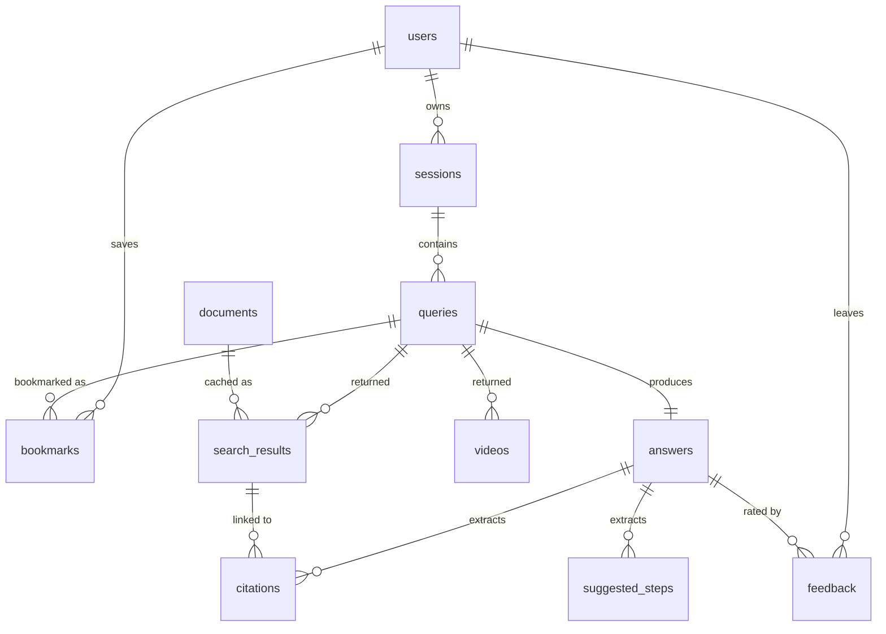

# Vidhi — Database Design (Neon Postgres)

> Status: **Draft v1** · Branch: `feat/neon-database` · Author: Paritosh
> Database: **Neon** (serverless Postgres, branchable, with `pgcrypto` + `pgvector` available)

---

## 1. Why a database, why now

Today Vidhi keeps everything in memory:

| Concern | Today | Problem |
|---|---|---|
| Sessions | `_sessions: Dict[str, SessionData]` in `session_store.py` | Lost on every redeploy / process restart. Single-process only — won't survive horizontal scale. |
| Search history | None | A user can't revisit "what did I ask Harvey last week?" |
| Search results | Refetched every time | Indian Kanoon and Google CSE both have hard quotas + cost; same query repeated = wasted spend. |
| Generated answers | Streamed and forgotten | No way to share a permalink, no way to thumbs-up / thumbs-down, no analytics. |
| Citations | Regex-extracted on the fly | Can't aggregate ("which sections of IPC do users ask about most?"). |
| Rate limits | In-memory dict | Resets on restart — gameable. |

Persisting these unblocks: **history**, **bookmarks**, **shareable answer permalinks**, **search-result caching**, **feedback loops**, **product analytics**.

We pick **Neon** because:

1. Serverless Postgres — scale-to-zero matches our spiky, demo-driven traffic.
2. Branching — every PR can have its own DB branch (mirrors the Netlify preview model already used by the frontend).
3. Standard Postgres wire protocol — works with `asyncpg` / SQLAlchemy / Alembic without lock-in.
4. `pgvector` is preinstalled — leaves the door open for semantic-similar-question retrieval later without a second datastore.

---

## 2. Design principles

1. **UUIDs everywhere** for primary keys. Generated client-side or via `gen_random_uuid()` (`pgcrypto`). Predictable, no leaky monotonic IDs in URLs.
2. **`created_at` / `updated_at` on every row.** Cheap, almost always asked for in retrospect.
3. **Soft delete for user-owned rows** (`deleted_at TIMESTAMPTZ NULL`). Hard delete only for caches and rate-limit windows.
4. **Append-only where possible** — `queries`, `answers`, `feedback` are immutable history. Easier to reason about, friendly to read replicas.
5. **`jsonb` for genuinely shape-shifting data** (provider-specific raw payloads, settings) — but always alongside typed columns for the fields we actually query on.
6. **Foreign keys with `ON DELETE CASCADE`** down the ownership chain (`user → session → query → answer → citation`). One delete cleans up the whole tree; satisfies a future "delete my data" request.
7. **`TIMESTAMPTZ`, not `TIMESTAMP`.** No naive datetimes. All times stored UTC.
8. **Enums as Postgres `ENUM`** for fixed small sets (`query_type`, `source`, `doc_type`); `CHECK` constraints for ratings. Migration cost of adding a value is acceptable; type safety > flexibility for these.

---

## 3. Entity-relationship overview



The chain a single user request flows through: **user → session → query → (search_results, videos, answer) → (citations, suggested_steps)**.

---

## 4. Tables

### 4.1 `users`

Identity. One row per Clerk user **and** one row per persistent guest device (so guest history survives a refresh).

| Column | Type | Notes |
|---|---|---|
| `id` | `uuid PK` | `gen_random_uuid()` default |
| `clerk_user_id` | `text UNIQUE` | NULL for guests |
| `is_guest` | `boolean NOT NULL DEFAULT false` | |
| `email` | `citext` | NULL for guests; `citext` so case-insensitive uniqueness is free |
| `display_name` | `text` | |
| `created_at` | `timestamptz NOT NULL DEFAULT now()` | |
| `last_seen_at` | `timestamptz NOT NULL DEFAULT now()` | Bumped on every authenticated request |
| `deleted_at` | `timestamptz` | Soft delete |

**Indexes**
- `UNIQUE (clerk_user_id) WHERE clerk_user_id IS NOT NULL` — partial unique, allows many guests with NULL.
- `INDEX (last_seen_at)` for activity queries.

**Why this shape:** Clerk owns auth; we just mirror the user record so we can foreign-key against it. Guests get a real row with `is_guest=true` and a cookie-stored `id` — no second code path needed downstream.

### 4.2 `sessions`

Replaces `app/utils/session_store.py`. Same semantics (TTL, last_accessed) but durable.

| Column | Type | Notes |
|---|---|---|
| `id` | `uuid PK` | The `session_id` already passed in URLs today. Frontend keeps generating it. |
| `user_id` | `uuid FK → users.id ON DELETE CASCADE` | |
| `created_at` | `timestamptz NOT NULL DEFAULT now()` | |
| `last_accessed_at` | `timestamptz NOT NULL DEFAULT now()` | |
| `expires_at` | `timestamptz NOT NULL` | `last_accessed_at + SESSION_TTL_SECONDS` |
| `metadata` | `jsonb NOT NULL DEFAULT '{}'` | UA, IP-hash, frontend version — anything we want to debug from later |

**Indexes**
- `INDEX (user_id, last_accessed_at DESC)` — "show this user's recent sessions".
- `INDEX (expires_at)` for the eviction sweeper.

**Eviction:** A small scheduled job (`DELETE FROM sessions WHERE expires_at < now()`) replaces the in-process `_evict_expired()` loop. Cheap because of the index.

### 4.3 `queries`

Every `POST /search/{session_id}` writes one row here. **Immutable.**

| Column | Type | Notes |
|---|---|---|
| `id` | `uuid PK` | |
| `session_id` | `uuid FK → sessions.id ON DELETE CASCADE` | |
| `user_id` | `uuid FK → users.id ON DELETE CASCADE` | Denormalized — most reads are "history for this user", not "queries in this session". Avoids a join. |
| `raw_query` | `text NOT NULL` | What the user typed |
| `rewritten_query` | `text` | Output of `rewrite_query_for_search()` — kept for debugging "why did we search for that?" |
| `query_type` | `query_type_enum NOT NULL` | `case_law` / `statute` / `general` |
| `result_count` | `integer NOT NULL DEFAULT 0` | Denormalized — cheap counter, avoids a `COUNT(*)` for list views |
| `search_latency_ms` | `integer` | Wall time for parallel search step |
| `created_at` | `timestamptz NOT NULL DEFAULT now()` | |
| `deleted_at` | `timestamptz` | Soft delete (user "clears history") |

**Indexes**
- `INDEX (user_id, created_at DESC) WHERE deleted_at IS NULL` — the history view.
- `INDEX (session_id, created_at)` — within-session order.
- `INDEX USING gin (to_tsvector('english', raw_query))` — full-text search across user's own history.

**Future:** add an `embedding vector(1024)` column under `pgvector` for semantic "I asked something like this before" recall.

### 4.4 `search_results`

The 10-or-so links returned per query.

| Column | Type | Notes |
|---|---|---|
| `id` | `uuid PK` | |
| `query_id` | `uuid FK → queries.id ON DELETE CASCADE` | |
| `rank` | `smallint NOT NULL` | 0-indexed position in the returned list |
| `source` | `source_enum NOT NULL` | `indian_kanoon` / `india_code` / `sci` / `google` |
| `doc_type` | `doc_type_enum NOT NULL` | `judgment` / `act` / `article` / `general` |
| `title` | `text NOT NULL` | |
| `url` | `text NOT NULL` | |
| `snippet` | `text` | |
| `search_content` | `text` | The longer extracted content blob |
| `jurisdiction` | `text` | "Supreme Court", "Delhi HC" — kept as text, not enum, because the long tail is real |
| `citation` | `text` | "AIR 2023 SC 1234", "Section 302 IPC" |
| `year` | `smallint` | |
| `document_id` | `uuid FK → documents.id` | NULL until we promote into the cache (§4.10) |
| `created_at` | `timestamptz NOT NULL DEFAULT now()` | |

**Indexes**
- `INDEX (query_id, rank)` — fetch in display order.
- `INDEX (url)` — cache lookup ("have we seen this URL before?").
- `INDEX (citation) WHERE citation IS NOT NULL` — "all results that cited X".

**Why no unique on `(query_id, url)`:** different sources legitimately surface the same URL with different snippets; we keep both for transparency.

### 4.5 `videos`

YouTube supplementary results. Mirrors `VideoResult` in `search_model.py`.

| Column | Type | Notes |
|---|---|---|
| `id` | `uuid PK` | |
| `query_id` | `uuid FK → queries.id ON DELETE CASCADE` | |
| `rank` | `smallint NOT NULL` | |
| `video_id` | `text NOT NULL` | YouTube's id, e.g. `dQw4w9WgXcQ` |
| `title`, `channel`, `description` | `text` | |
| `thumbnail_url`, `url` | `text NOT NULL` | |
| `published_at` | `timestamptz` | |
| `duration_seconds` | `integer` | Normalised — current code stores ISO-8601 strings; we parse on insert |
| `created_at` | `timestamptz NOT NULL DEFAULT now()` | |

**Indexes**
- `INDEX (query_id, rank)`.
- `INDEX (video_id)` — to deduplicate or join into a future `videos_master` cache.

### 4.6 `answers`

Generated LLM response. **One per query** (the `UNIQUE` enforces that).

| Column | Type | Notes |
|---|---|---|
| `id` | `uuid PK` | |
| `query_id` | `uuid UNIQUE NOT NULL FK → queries.id ON DELETE CASCADE` | |
| `content` | `text NOT NULL` | Full final stream, joined |
| `model` | `text NOT NULL` | e.g. `@cf/meta/llama-3.1-8b-instruct` |
| `prompt_tokens` / `completion_tokens` | `integer` | NULL when provider doesn't return |
| `status` | `answer_status_enum NOT NULL` | `streaming` / `complete` / `error` |
| `error_message` | `text` | Populated only on `error` |
| `created_at` | `timestamptz NOT NULL DEFAULT now()` | |
| `completed_at` | `timestamptz` | NULL while streaming |
| `latency_ms` | `integer` | `completed_at - created_at` |

**Indexes**
- `UNIQUE (query_id)` (constraint) — there is exactly one answer per query.
- `INDEX (created_at)` for analytics.

**Streaming write strategy:** insert with `status='streaming'` *before* the SSE loop, append chunks to `content` is too noisy → instead, buffer in-process (we already do via `full_text = []`) and write `content + status='complete'` in a single `UPDATE` after the stream finishes. If the connection drops, the row is left in `streaming` and a sweeper transitions it to `error` after N seconds.

### 4.7 `citations`

Extracted from the answer text by `extract_citations()`. Storing them relationally is the unlock for "most-cited acts this month" dashboards.

| Column | Type | Notes |
|---|---|---|
| `id` | `uuid PK` | |
| `answer_id` | `uuid FK → answers.id ON DELETE CASCADE` | |
| `citation_text` | `text NOT NULL` | "Section 302 IPC", "AIR 2023 SC 1234" |
| `citation_type` | `text` | `case` / `section` / `act` — kept as text, classifier may evolve |
| `source_result_id` | `uuid FK → search_results.id` | NULL when we couldn't match it back to a returned result |
| `char_start`, `char_end` | `integer` | Offsets in `answers.content` — lets the frontend underline the citation in place |
| `created_at` | `timestamptz NOT NULL DEFAULT now()` | |

**Indexes**
- `INDEX (answer_id)`.
- `INDEX (citation_text)` — popularity queries.

### 4.8 `suggested_steps`

The "next steps" Harvey recommends — extracted once per answer.

| Column | Type | Notes |
|---|---|---|
| `id` | `uuid PK` | |
| `answer_id` | `uuid FK → answers.id ON DELETE CASCADE` | |
| `rank` | `smallint NOT NULL` | Display order |
| `text` | `text NOT NULL` | |

**Index**: `UNIQUE (answer_id, rank)`.

### 4.9 `bookmarks` / `feedback`

Both small, both per-(user, target). Both useful from day one.

```
bookmarks(id pk, user_id fk, query_id fk, note text, created_at, UNIQUE(user_id, query_id))
feedback (id pk, user_id fk, answer_id fk, rating smallint CHECK rating IN (-1,0,1),
          comment text, created_at, UNIQUE(user_id, answer_id))
```

`UNIQUE(user_id, target)` means thumbs-up is upsert, not insert — no duplicate rows when a user clicks twice.

### 4.10 `documents` *(cache, phase 2)*

The cross-query cache. Right now `search_results` repeats the same Indian Kanoon judgment text per query — wasteful. Once we have query volume, promote URL-keyed bodies here.

| Column | Type | Notes |
|---|---|---|
| `id` | `uuid PK` | |
| `url` | `text UNIQUE NOT NULL` | Cache key |
| `source`, `doc_type` | enums | |
| `title`, `citation`, `jurisdiction`, `year` | | Same shape as `search_results` |
| `content` | `text` | Full extracted body |
| `content_hash` | `bytea` | `sha256(content)` — change-detection |
| `first_fetched_at`, `last_fetched_at`, `fetch_count` | | |

`search_results.document_id` then points here, and `search_content` becomes a tombstone/null we can drop.

### 4.11 `rate_limits` *(optional)*

Replacement for `app/utils/rate_limiter.py`. Honestly **Redis fits this better** — it's high-write, low-value-per-row, and naturally TTL'd. But Neon can do it acceptably with a fixed-window table:

```
rate_limits(
  subject text NOT NULL,        -- user_id::text or anonymous IP hash
  endpoint text NOT NULL,
  window_start timestamptz NOT NULL,  -- truncated to the minute
  count integer NOT NULL DEFAULT 0,
  PRIMARY KEY (subject, endpoint, window_start)
)
```

Increment via `INSERT ... ON CONFLICT (subject,endpoint,window_start) DO UPDATE SET count = count + 1 RETURNING count`. Sweep older than 5 minutes. **Recommendation: keep this in-memory or move to Upstash Redis; only persist if we need cross-process correctness on Render.**

---

## 5. Indexes — the four that matter most

The schema has many indexes; these are the ones that pay rent every request:

1. `queries (user_id, created_at DESC) WHERE deleted_at IS NULL` — drives the history sidebar.
2. `sessions (expires_at)` — keeps the eviction sweep O(expired), not O(all).
3. `search_results (url)` — cache lookups before hitting Indian Kanoon.
4. `users (clerk_user_id) WHERE clerk_user_id IS NOT NULL` (partial unique) — every authenticated request resolves a user from this.

Everything else is nice-to-have and can be added when slow-query logs say so.

---

## 6. Migration & ops

**Tooling:** Alembic, async SQLAlchemy 2.x, `asyncpg` driver. Reason: SQLAlchemy is already in the FastAPI ecosystem; Alembic gives versioned migrations that diff cleanly. Avoid Tortoise/SQLModel — too opinionated for a schema this typed.

**File layout (proposed, not yet built):**

```
backend/
├── alembic.ini
├── app/
│   └── db/
│       ├── __init__.py
│       ├── base.py          # declarative Base
│       ├── session.py       # async engine + session factory
│       ├── models/          # one file per table
│       └── migrations/
│           └── versions/
```

**Connection string:** read `DATABASE_URL` from env (Neon gives you a `postgres://` and a pooled `postgres-pooler://`). Use the **pooled** URL for Render web workers, the **unpooled** URL for migrations.

**Branching strategy on Neon:**
- `main` branch → production DB.
- `dev` branch (Neon-side) → shared dev DB.
- Each PR optionally creates an ephemeral branch — wired through GitHub Action `neondatabase/create-branch-action` later.

**Backups:** Neon has point-in-time-restore for 7 days on the free tier — sufficient for now. Schedule a weekly logical dump to S3 once we have user data we don't want to lose.

**Secrets:** `DATABASE_URL` lives in Render env + a `.env.example` placeholder. Never committed.

---

## 7. Privacy & retention

Legal queries can be sensitive (someone researching their own case). Decisions:

- **Default retention: 90 days for guest users**, indefinite for authenticated. Soft-delete past that; hard-purge after another 30 days.
- **`DELETE my data` endpoint** — `DELETE FROM users WHERE id = $1` cascades through everything via the FK chain. The schema is already shaped for this.
- **No PII in logs.** `raw_query` lives in the DB only; the application logger gets `query_id` instead of the text.

---

## 8. What this design deliberately does *not* do

- **No multi-tenancy / orgs.** Vidhi is a single-user product today; adding `org_id` everywhere now is premature.
- **No event-sourcing or audit log table.** `created_at` + immutability of the core tables is enough; bring in an audit log when there's a compliance ask.
- **No materialized views.** The history view is fast enough on a btree index. Revisit if a dashboard needs ~50ms aggregates.
- **No `pgvector` columns yet** — extension is enabled, columns aren't created. Adds cost (storage + index build) we don't need until we ship semantic search.

---

## 9. Open questions

1. **Guest identity.** Cookie-stored `user_id` is the simplest answer, but it's spoofable. Acceptable for read-only history; we lean on Clerk for anything destructive.
2. **Should `videos` cascade-delete with the query, or live in a long-term table keyed by YouTube `video_id`?** Today: cascade. Revisit if we add per-video bookmarking.
3. **Streaming-write vs final-write for answers.** Final-write is simpler; the only loss is "I closed the tab mid-stream and now there's no record." Acceptable until users complain.

---

## 10. Next steps

1. Review this doc — **anything in §4 wrong or missing?**
2. Land [`docs/schema.sql`](./schema.sql) — runnable DDL that matches §4 exactly.
3. Wire up Alembic + `app/db/`. First migration is `schema.sql` translated.
4. Refactor `session_store.py` and `query_handler.py` to write through the DB. Keep the in-memory path behind a `DATABASE_URL == ""` fallback so local dev without Neon still works.
5. Backfill: nothing to backfill — clean slate.
